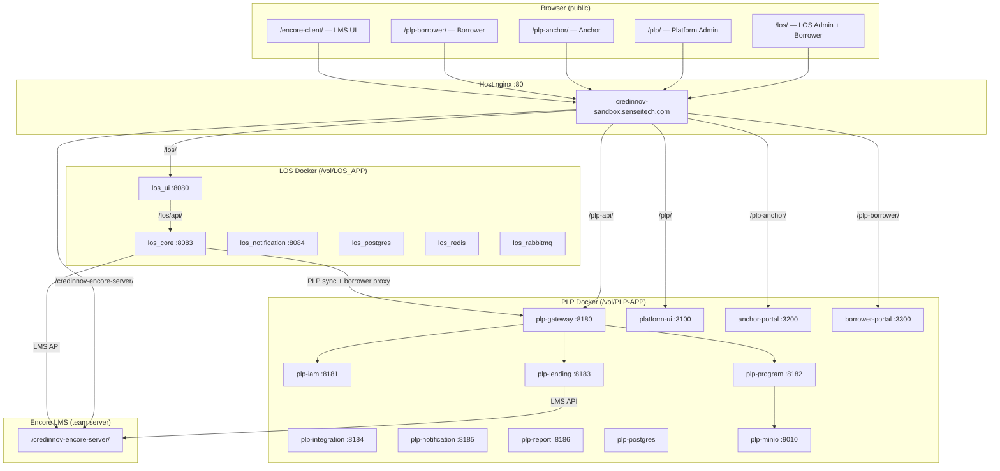
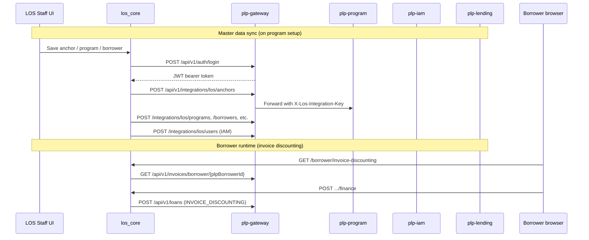

# LOS & PLP — Architecture, Integration, and Deployment Reference

**Environment:** Credinnov sandbox (`credinnov` branch)  
**Host:** `credinnov-sandbox.senseitech.com` (AWS EC2)  
**Last updated:** June 2026

This document describes the Loan Origination System (LOS) and Program Lending Platform (PLP): technology stacks, how they connect to each other and to Encore LMS, port mappings, server configuration, and deployment procedures on the Credinnov EC2 sandbox.

---

## Table of contents

1. [System overview](#1-system-overview)
2. [Technology stacks](#2-technology-stacks)
3. [LOS application](#3-los-application)
4. [PLP application](#4-plp-application)
5. [LOS ↔ PLP integration](#5-los--plp-integration)
6. [LMS (Encore) integration](#6-lms-encore-integration)
7. [PayU payment flows](#7-payu-payment-flows)
8. [Authentication and security](#8-authentication-and-security)
9. [Data stores and messaging](#9-data-stores-and-messaging)
10. [Public URLs and nginx routing](#10-public-urls-and-nginx-routing)
11. [EC2 deployment](#11-ec2-deployment)
12. [Current server configuration](#12-current-server-configuration)
13. [Sandbox users and roles](#13-sandbox-users-and-roles)
14. [Operational troubleshooting](#14-operational-troubleshooting)
15. [Related documentation](#15-related-documentation)

---

## 1. System overview

Credinnov runs three cooperating systems on one EC2 instance:

| System | Purpose |
|--------|---------|
| **LOS** | Loan origination — applications, KYC, underwriting, workflow, staff admin, borrower self-service for personal/term loans |
| **PLP** | Program lending — anchors, programs, sub-programs, invoice discounting, pay-day loans, disbursements, repayments |
| **Encore LMS** | Loan management system — loan accounts, schedules, transactions, preclosure (hosted separately; proxied via nginx) |

**High-level flow:**

- Staff originate loans in **LOS** (personal loan, term loan, anchor onboarding).
- When a product is invoice discounting or program-based, LOS **syncs master data** (anchor, program, sub-program, borrower, links) into **PLP**.
- Borrowers use the **LOS borrower portal** for invoice discounting (LOS proxies PLP APIs server-side).
- Borrowers use the **PLP borrower portal** for native PLP invoice/pay-day flows.
- On disbursement/sanction, both LOS and PLP can post loan accounts to **Encore LMS** when `lms_entry_in = YES` on the program.



---

## 2. Technology stacks

### LOS

| Layer | Technology |
|-------|------------|
| Backend | Java 17, Spring Boot 3.3, Spring Cloud 2023.0 |
| Build | Maven (multi-module monorepo) |
| Frontend (deployed) | React 18, TypeScript, Vite 8, Tailwind CSS v4 (`ui-service/`) |
| Frontend (legacy) | Next.js 16 (`frontend/`) — not used in prod compose |
| Database | PostgreSQL 15, Flyway migrations, Hibernate `validate` |
| Cache | Redis 7 |
| Messaging | RabbitMQ 3 (notifications) |
| File storage | Local filesystem (`/data/documents` volume); MinIO optional |
| API docs | SpringDoc OpenAPI / Swagger |
| Containers | Docker Compose (`docker-compose.prod.yml`) |

### PLP

| Layer | Technology |
|-------|------------|
| Backend | Java 21, Spring Boot 3.4, Spring Cloud 2024 |
| Build | Maven (`./mvnw`) |
| Frontend | React 18, TypeScript, Vite 6, Tailwind CSS 4 (monorepo: `platform-ui`, `anchor-portal`, `borrower-portal`, `shared`) |
| Database | PostgreSQL 16, schema-per-service, Flyway |
| Cache | Redis 7.2 |
| Messaging | RabbitMQ 3.13 |
| Object storage | MinIO (digital invoice files) |
| Service discovery | Netflix Eureka |
| API gateway | Spring Cloud Gateway (JWT, routing, CORS) |
| Containers | Docker Compose (3-file stack on sandbox) |

### Shared external services

| Service | Use |
|---------|-----|
| Encore LMS | Loan account lifecycle, schedules, repayments |
| PayU | Payment gateway (test merchant on sandbox) |
| Karza, Equifax, Hyperverge, emsigner | KYC, bureau, VKYC, eSign (LOS) |
| AI-LOS | Optional AI integration (LOS) |

---

## 3. LOS application

### 3.1 Repository and deploy path

| Item | Value |
|------|-------|
| GitHub | `https://github.com/vigneshsivasubramaniam333-stack/LOS_APP.git` |
| Branch | `credinnov` |
| EC2 path | `/vol/LOS_APP` |
| Compose file | `docker-compose.prod.yml` |

### 3.2 Services and ports (production compose)

| Service | Container | Host port | Internal port | Role |
|---------|-----------|-----------|---------------|------|
| discovery-service | `los_discovery` | 8761 | 8761 | Eureka (optional in prod) |
| postgres | `los_postgres` | *(none)* | 5432 | Database `losdb` |
| redis | `los_redis` | 6379 | 6379 | Cache / OTP |
| rabbitmq | `los_rabbitmq` | 5672, 15672 | 5672, 15672 | Event bus |
| **los-core** | `los_core` | *(expose only)* | **8083** | Main API — all business logic |
| notification-service | `los_notification` | 8084 | 8084 | Email / SMS / WhatsApp |
| **ui-service** | `los_ui` | **8080** | 80 | React UI + nginx proxy to los-core |

> **Note:** In production, `los-core` is **not** host-exposed. The UI container nginx proxies `/los/api/` → `los-core:8083`. Host nginx proxies `/los/` → `127.0.0.1:8080/los/`.

Additional services exist in the codebase (`api-gateway` 8080, `iam-service` 8081, `enrollment-service` 8082) but are **not** part of `docker-compose.prod.yml`. LOS prod runs los-core standalone with discovery disabled.

### 3.3 Key functionalities

#### Staff / admin (`/los/`)

- Loan application intake (personal loan, term loan, anchor onboarding)
- KYC orchestration (Karza, bureau, document upload)
- Workflow engine (approval chains, TAT, overrides)
- Credit decision, underwriting, CAM workbench, scorecards
- Sanction, KFS generation, eSign (emsigner)
- Account Aggregator, NACH, collateral, co-lending
- Video KYC (Hyperverge)
- PLP program setup (sync anchor/program/sub-program to PLP)
- LMS handover to Encore (when configured)
- PG settlements (PayU for LOS personal/term loans)
- Repayment defaults per product
- Application deletion with audit log (V63) + PLP cleanup
- Demo reset (`LOS_DEMO_ENABLED=true` on sandbox)
- Reports, geo masters, assignment rules

#### Borrower portal (`/los/borrower`)

- View and manage loan applications
- Upload documents, complete eSign / KFS
- View programs and limits
- **Invoice discounting** (proxied from PLP):
  - List invoices (standard, purchase order, sales bill flows via `flowType`)
  - Accept purchase-flow invoices
  - Request finance against eligible invoices
  - View loans and repayment history
  - PayU payment cart for invoice-discounting repayments
- Create seller-initiated invoices (PO / SBD flows)
- Delete draft applications

### 3.4 API surface (los-core)

Base path: `/api/v1/` (proxied as `/los/api/v1/` through UI nginx).

| Module | Path prefix | Notes |
|--------|-------------|-------|
| Applications | `/applications` | CRUD, workflow, sanction |
| Borrower | `/borrower` | Self-service portal |
| Invoice discounting | `/borrower/invoice-discounting` | PLP-backed |
| KYC | `/kyc` | Verification orchestration |
| Workflow | `/workflows` | Process definitions |
| Documents | `/documents` | Upload / download |
| LMS | `/lms` | Encore proxy / handover |
| PayU webhooks | `/webhooks/los-payments/payu/*` | Public callbacks |
| Demo | `/demo/status`, `/demo/applications` | Sandbox reset |
| Admin | `/admin` | Configuration |

### 3.5 Database

- **Engine:** PostgreSQL 15 (`los_postgres`)
- **Database:** `losdb` (user `losuser`)
- **Migrations:** Flyway in `services/los-core-service/src/main/resources/db/migration/` (V1–V63+)
- **Notable migrations:**
  - V41–V49: LMS integration tables
  - V50–V51, V55: Invoice discounting workflows
  - V52–V56: PLP integration masters and sync
  - V57: Credinnov sandbox user seeds
  - V62: LOS PayU payments
  - V63: Application deletion audit log

### 3.6 File storage

| Setting | Value (prod) |
|---------|--------------|
| `LOS_DOCUMENT_STORAGE` | `local` |
| `LOS_FILE_STORAGE_ROOT` | `/data/documents` |
| Docker volume | `los_documents` mounted on `los_core` |

---

## 4. PLP application

### 4.1 Repository and deploy path

| Item | Value |
|------|-------|
| GitHub | `https://github.com/vigneshsivasubramaniam333-stack/PLP-APP.git` |
| Branch | `credinnov` |
| EC2 path | `/vol/PLP-APP` |
| Compose files | `docker-compose.yml` + `docker-compose.sandbox.yml` + `docker-compose.ui.yml` |

### 4.2 Microservices and ports

Host ports are remapped to avoid conflicts with LOS on the same EC2 instance.

| Service | Container | Host port | Internal port | Role |
|---------|-----------|-----------|---------------|------|
| discovery-service | `plp-discovery` | 8861 | 8761 | Eureka registry |
| **api-gateway** | `plp-gateway` | **8180** | 8080 | JWT, routing, CORS |
| iam-service | `plp-iam` | 8181 | 8081 | Auth, RBAC, LOS user provisioning |
| **program-service** | `plp-program` | **8182** | 8082 | Programs, anchors, borrowers, invoices, limits, MinIO |
| **lending-service** | `plp-lending` | **8183** | 8083 | Loans, disbursements, repayments, PayU, Encore LMS |
| integration-service | `plp-integration` | 8184 | 8084 | External adapters, PayU webhooks |
| notification-service | `plp-notification` | 8185 | 8085 | Email/SMS via RabbitMQ |
| report-service | `plp-report` | 8186 | 8086 | MIS, audit reports |

#### Infrastructure

| Service | Container | Host port | Internal port |
|---------|-----------|-----------|---------------|
| postgres | `plp-postgres` | 5433 | 5432 |
| redis | `plp-redis` | 6380 | 6379 |
| rabbitmq | `plp-rabbitmq` | 5673, 15673 | 5672, 15672 |
| minio | `plp-minio` | 9010, 9011 | 9000, 9001 |

#### Frontend portals (`docker-compose.ui.yml`)

| Portal | Container | Host port | Base path | Users |
|--------|-----------|-----------|-----------|-------|
| Platform UI | `plp-platform-ui` | **3100** | `/plp/` | Platform admin, credit, accounts |
| Anchor portal | `plp-anchor-portal` | **3200** | `/plp-anchor/` | Anchor admins (employers/sellers) |
| Borrower portal | `plp-borrower-portal` | **3300** | `/plp-borrower/` | Borrowers (employees/buyers) |

### 4.3 Lending products

| Product | Code | Anchor | Borrower | Collateral | Tenure |
|---------|------|--------|----------|------------|--------|
| Pay Day Loan (EWA) | `PAY_DAY_LOAN` | Employer | Employee | Earned salary | 7–60 days |
| Invoice Discounting | `INVOICE_DISCOUNTING` | Seller (invoice raiser) | Purchaser/Buyer | Purchase invoice | 30–180 days |

#### Invoice discounting flow types (`InvoiceDiscountingFlowType`)

| Flow | Description |
|------|-------------|
| Standard invoice discounting | Anchor uploads invoice; borrower requests finance |
| Purchase order discounting (PO) | Borrower creates PO; anchor accepts; borrower requests finance |
| Sales bill discounting (SBD) | Borrower creates sales bill; anchor accepts; borrower requests finance |

### 4.4 Key functionalities

#### Platform admin (`/plp/`)

- Lender, program, sub-program management
- Anchor and borrower onboarding
- Sub-program borrower enrollment and limit configuration
- Per-borrower repayment/collection account metadata (V28)
- Invoice lifecycle management
- Loan sanction, disbursement, rejection
- PG settlements (PayU invoice-discounting collections)
- Repayment defaults per product (global)
- Notifications configuration
- Dev/demo reset (`PLP_DEV_RESET_ENABLED`)

#### Anchor portal (`/plp-anchor/`)

- View and approve invoices
- Seller-initiated invoice flows (PO/SBD)
- Program and limit visibility

#### Borrower portal (`/plp-borrower/`)

- Invoice discounting (list, accept, request finance)
- Purchase order and sales bill discounting pages
- Seller-initiated invoice creation
- Loan view and repayments
- PayU payment cart

#### Backend capabilities

- Digital invoice file storage (MinIO + local fallback)
- Invoice due-date reminder notifications (cron job)
- LOS integration endpoints (machine-to-machine)
- LOS application cleanup (delete borrower loans on application deletion)
- Encore LMS account opening and transaction posting
- Early-pay (SBD) flows
- Smart Collect vs PayU repayment method resolution

### 4.5 Database schemas (single DB `plp_db`)

| Schema | Service |
|--------|---------|
| `plp_iam` | iam-service |
| `plp_program` | program-service |
| `plp_lending` | lending-service |
| `plp_integration` | integration-service |
| `plp_notification` | notification-service |
| `plp_report` | report-service |

Flyway migrations run per-service on startup. Notable: V28 (repayment accounts), V27 (auto-approve), V3 notification (invoice due-date).

---

## 5. LOS ↔ PLP integration

### 5.1 Direction and pattern

**LOS is the orchestrator.** When staff set up anchors, programs, and borrowers in LOS, LOS pushes data to PLP via machine-to-machine HTTP calls. At runtime, LOS also **proxies** borrower invoice-discounting actions to PLP.



### 5.2 LOS clients (Java)

| Client | Package | Purpose |
|--------|---------|---------|
| `PlpIntegrationClient` | `com.los.plp.client` | Login, JWT cache, master-data sync |
| `PlpBorrowerClient` | `com.los.plp.client` | Borrower invoices, loans, repayments, payment cart, PayU initiate |

### 5.3 PLP integration endpoints

All under `/api/v1/integrations/los/` on **program-service** (routed first by gateway).

| Endpoint | Direction | Purpose |
|----------|-----------|---------|
| `POST /anchors` | LOS → PLP | Sync anchor master |
| `POST /programs` | LOS → PLP | Sync program |
| `POST /sub-programs` | LOS → PLP | Sync sub-program |
| `POST /borrowers` | LOS → PLP | Sync borrower |
| `POST /sub-program-borrower-links` | LOS → PLP | Enroll borrower on sub-program |
| `POST /borrower-program-mappings` | LOS → PLP | Map borrower to program |
| `POST /application-cleanup` | LOS → PLP | Remove PLP data on application deletion |
| `POST /users` (iam-service) | LOS → PLP | Provision PLP portal user |
| `DELETE /users/by-linked-entity` (iam-service) | LOS → PLP | Remove PLP user |
| `POST /borrowers/{id}/cleanup` (lending-service) | LOS → PLP | Remove borrower loans |

### 5.4 Authentication between LOS and PLP

| Mechanism | Header / credential | Used for |
|-----------|---------------------|----------|
| JWT (machine user) | `Authorization: Bearer <token>` | LOS logs in as `PLP_INTEGRATION_EMAIL` / `PLP_INTEGRATION_PASSWORD` |
| Integration API key | `X-Los-Integration-Key: <PLP_LOS_INTEGRATION_API_KEY>` | LOS → PLP integration controllers |

Default sandbox values (both sides must match):

```
PLP_INTEGRATION_EMAIL=admin@credinnov.com
PLP_INTEGRATION_PASSWORD=Bltest@123
PLP_LOS_INTEGRATION_API_KEY=plp-los-integration-dev-key
PLP_BASE_URL=http://host.docker.internal:8180   # LOS container → PLP gateway on host
```

### 5.5 Borrower identity mapping

LOS stores `plp_borrower_id` on the borrower's loan application after PLP sync. `BorrowerInvoiceDiscountingService` resolves this UUID and calls `PlpBorrowerClient` with the PLP lender machine identity.

### 5.6 Invoice discounting from LOS borrower portal

The LOS borrower UI does **not** call PLP directly. All calls go to LOS `/api/v1/borrower/invoice-discounting/*`, which proxies to PLP:

| LOS endpoint | PLP endpoint |
|--------------|--------------|
| `GET /borrower/invoice-discounting` | `GET /api/v1/invoices/borrower/{id}`, `GET /api/v1/loans?borrowerId=` |
| `POST .../invoices/{id}/accept` | `POST /api/v1/invoices/{id}/borrower-accept` |
| `POST .../invoices/{id}/finance` | `POST /api/v1/loans` (`productType=INVOICE_DISCOUNTING`) |
| `POST .../loans/{id}/repay` | `POST /api/v1/loans/{id}/repay` |
| `GET .../payments/cart` | `GET /api/v1/portal/borrower/payments/checkout/lines` |
| `POST .../payments/payu/initiate` | `POST /api/v1/portal/borrower/payments/payu/initiate` |
| `GET .../invoices/{id}/digital-invoice` | `GET /api/v1/invoices/{id}/digital-invoice/download` |

---

## 6. LMS (Encore) integration

### 6.1 Architecture

Encore LMS runs as a **separate team-managed server** on the same EC2 host. It is **not** containerized inside LOS or PLP compose stacks.

| Component | URL |
|-----------|-----|
| Encore UI | `http://credinnov-sandbox.senseitech.com/encore-client/` |
| Encore webservices API | `http://credinnov-sandbox.senseitech.com/credinnov-encore-server/` |
| Backend (localhost) | `127.0.0.1:8091` (proxied by host nginx) |

Both LOS (`los_core`) and PLP (`plp-lending`) call Encore over HTTP using the public nginx path (not `localhost:8091` directly from containers).

### 6.2 When LMS is used

| App | Trigger | Gating |
|-----|---------|--------|
| LOS | Loan handover after sanction/disbursal | `LMS_ENCORE_SYNC_ENABLED`, workflow product mapping (V45) |
| PLP | Loan disbursement | Program field `lms_entry_in = YES` and `encore_product_code` set |

When `lms_entry_in = NO`, PLP keeps internal `loanNumber` and local interest math. When `YES`, Encore account ID is stored in `loans.lms_account_id`.

### 6.3 Encore client configuration

#### LOS (`los.lms.encore.*`)

| Env var | Sandbox value |
|---------|---------------|
| `ENCORE_BASE_URL` | `http://credinnov-sandbox.senseitech.com/credinnov-encore-server/` |
| `ENCORE_API_USERNAME` | `admin` |
| `ENCORE_API_PASSWORD` | `password1` |
| `ENCORE_REST_AUTH_TOKEN` | Optional session token for REST `api/*` paths |

Prod compose **hardcodes** username/password in `environment:` to override stale `.env.prod` values.

#### PLP (`plp.lms.encore.*` on lending-service)

Same `ENCORE_BASE_URL` and credentials. `plp-lending` has `extra_hosts: host.docker.internal:host-gateway` for host-bound services.

### 6.4 Key Encore API operations

| Operation | Endpoint | Auth |
|-----------|----------|------|
| Open loan account | `webservices/openAccount` | Basic |
| Post transaction | `webservices/postTransactions` | Basic |
| Find summaries | `webservices/findSummaries` | Basic |
| Loan OD accounts | `api/loan-od-accounts/{id}` | `X-Auth-Token` |
| Preclosure amount | `webservices/findPreclosureAmountAsOfDate` | Basic |
| Bank working date | `webservices/findBankWorkingDate` | Basic |

LOS exposes LMS operations under `/api/v1/lms/**` on los-core.

---

## 7. PayU payment flows

Sandbox uses PayU **test** merchant (`https://test.payu.in/_payment`).

| Setting | Value |
|---------|-------|
| `PAYU_MERCHANT_KEY` | `g8yc8J` |
| `PAYU_MERCHANT_SALT` | `BBc2U41mOZPLuteAYBW9wJ2Lnm9V9rQV` |

### 7.1 LOS personal/term loan repayments

| Item | Value |
|------|-------|
| Service | `los_core` |
| Public API base | `LOS_PUBLIC_API_BASE_URL` → `http://credinnov-sandbox.senseitech.com/los` |
| Success callback | `/los/api/v1/webhooks/los-payments/payu/success` |
| Failure callback | `/los/api/v1/webhooks/los-payments/payu/failure` |
| Borrower redirect | `LOS_BORROWER_UI_URL` |

### 7.2 PLP invoice-discounting repayments

| Item | Value |
|------|-------|
| Service | `plp-lending` (+ `plp-integration` webhooks) |
| Public API base | `PLP_PUBLIC_API_BASE_URL` → `http://credinnov-sandbox.senseitech.com/plp-api` |
| Success callback | `/plp-api/api/v1/webhooks/payments/payu/success` |
| Failure callback | `/plp-api/api/v1/webhooks/payments/payu/failure` |
| Borrower redirect | `PLP_BORROWER_UI_URL` or `LOS_BORROWER_UI_URL` (when initiated from LOS) |

> **Critical:** Invoice-discounting PayU initiated from the **LOS borrower portal** still builds surl/furl in **PLP lending-service**. `docker-compose.sandbox.yml` must be used on EC2 so `PLP_PUBLIC_API_BASE_URL` is not `localhost:8180`.

### 7.3 Repayment method resolution (PLP)

1. Borrower enrollment override (`CUSTOM`)
2. Platform global default (`product_repayment_defaults`)
3. System fallback: `SMART_COLLECT`

PayU PG settlements are posted by accounts staff via PG Settlements pages (LOS admin for term loans; PLP platform for invoice discounting).

---

## 8. Authentication and security

### 8.1 LOS

| Context | Mechanism |
|---------|-----------|
| Staff UI | Session / trusted headers (`X-User-Id`, `X-User-Role`) |
| Borrower portal | Same headers; `requireBorrower(role)` enforces `BORROWER` |
| PayU webhooks | Public (no JWT); hash verification |
| PLP integration | JWT machine login |
| Local dev | `local` profile permits all (`los.security.local-dev-permit-all`) |

Roles: Administrator, Credit Manager, Credit Officer, Sales, Accounts, Borrower.

### 8.2 PLP

| Context | Mechanism |
|---------|-----------|
| Portal login | JWT issued by `iam-service`, validated by `api-gateway` |
| LOS integration | `X-Los-Integration-Key` (bypasses user JWT) |
| Token expiry | Access 8 h, refresh 24 h |

PLP roles: PLATFORM_ADMIN, CREDIT_MANAGER, CREDIT_ANALYST, COMPLIANCE_OFFICER, ACCOUNTS_OFFICER, ANCHOR_ADMIN, BORROWER.

### 8.3 Default passwords (sandbox)

| System | Password |
|--------|----------|
| All Credinnov users | `Bltest@123` |
| LOS-provisioned PLP users | `PLP_INTEGRATION_DEFAULT_USER_PASSWORD` = `ChangeMe@PLP2026` |
| Encore LMS | `admin` / `password1` |

---

## 9. Data stores and messaging

### 9.1 LOS

| Store | Container | Purpose |
|-------|-----------|---------|
| PostgreSQL | `los_postgres` | Primary data (`losdb`) |
| Redis | `los_redis` | Cache, OTP, rate limiting |
| RabbitMQ | `los_rabbitmq` | Notification events |
| Volume `los_documents` | `los_core` | Uploaded documents |

### 9.2 PLP

| Store | Container | Purpose |
|-------|-----------|---------|
| PostgreSQL | `plp-postgres` | `plp_db` (6 schemas) |
| Redis | `plp-redis` | Limits, sessions |
| RabbitMQ | `plp-rabbitmq` | Notifications, loan events |
| MinIO | `plp-minio` | Digital invoice files (`plp-invoices` bucket) |
| Volume `plp_digital_invoices` | `plp-program` | Local fallback storage |

### 9.3 Docker networks

| Stack | Network | Notes |
|-------|---------|-------|
| LOS | default bridge | `extra_hosts: host.docker.internal` for PLP gateway |
| PLP | `plp-net` | Internal service discovery via Eureka |

Optional: `docker-compose.plp-integration.yml` on LOS joins `plp_plp-net` so `PLP_BASE_URL=http://api-gateway:8080` works without host port.

---

## 10. Public URLs and nginx routing

Host **nginx** on port 80 owns `credinnov-sandbox.senseitech.com`. Docker services bind to localhost only (security group: public 80).

### 10.1 URL map

| Public URL | nginx proxy target | Application |
|------------|-------------------|-------------|
| `http://credinnov-sandbox.senseitech.com/los/` | `127.0.0.1:8080/los/` | LOS UI + API |
| `http://credinnov-sandbox.senseitech.com/los/borrower` | (same, client-side route) | LOS borrower portal |
| `http://credinnov-sandbox.senseitech.com/plp/` | `127.0.0.1:3100` | PLP platform admin |
| `http://credinnov-sandbox.senseitech.com/plp-anchor/` | `127.0.0.1:3200` | PLP anchor portal |
| `http://credinnov-sandbox.senseitech.com/plp-borrower/` | `127.0.0.1:3300` | PLP borrower portal |
| `http://credinnov-sandbox.senseitech.com/plp-api/` | `127.0.0.1:8180/` | PLP API gateway |
| `http://credinnov-sandbox.senseitech.com/encore-client/` | Team static | Encore LMS UI |
| `http://credinnov-sandbox.senseitech.com/credinnov-encore-server/` | `127.0.0.1:8091` | Encore webservices |

### 10.2 LOS UI internal proxy

The `los_ui` container nginx serves the React app at `/los/` and proxies:

- `/los/api/` → `http://los_core:8083/api/`

Built with `VITE_BASE_PATH=/los/` and `VITE_API_BASE_URL=/los/api/v1`.

### 10.3 PLP UI API config

PLP portal containers use `env-config.js`:

```javascript
window.__ENV__ = { VITE_API_BASE_URL: '/plp-api' };
```

Files on EC2:

- `/vol/PLP-APP/frontend/packages/platform-ui/docker/env-config.js`
- `/vol/PLP-APP/frontend/packages/anchor-portal/docker/env-config.js`
- `/vol/PLP-APP/frontend/packages/borrower-portal/docker/env-config.js`

### 10.4 Nginx snippet install

```bash
cd /vol/LOS_APP
sudo cp deploy/nginx/los-host-locations.conf /etc/nginx/snippets/
sudo cp deploy/nginx/plp-host-locations.conf /etc/nginx/snippets/
# Add to server block:
#   include snippets/los-host-locations.conf;
#   include snippets/plp-host-locations.conf;
sudo nginx -t && sudo systemctl reload nginx
```

See `deploy/nginx/README.md` for full instructions.

### 10.5 Complete localhost port reference (EC2)

| Port | Service |
|------|---------|
| 80 | Host nginx (public) |
| 8080 | LOS UI (`los_ui`) |
| 8083 | LOS core (internal only in prod) |
| 8084 | LOS notification |
| 8091 | Encore Tomcat (team) |
| 3100 | PLP platform UI |
| 3200 | PLP anchor portal |
| 3300 | PLP borrower portal |
| 5433 | PLP Postgres (host) |
| 5673 | PLP RabbitMQ |
| 6380 | PLP Redis |
| 8180 | PLP API gateway |
| 8181–8186 | PLP microservices |
| 8861 | PLP Eureka |
| 9010 | PLP MinIO API |

---

## 11. EC2 deployment

### 11.1 Prerequisites

- Git repos cloned at `/vol/LOS_APP` and `/vol/PLP-APP`
- Branch `credinnov` checked out on both
- `.env.prod` (LOS) and `.env` (PLP) configured on server
- Host nginx snippets installed
- Docker and Docker Compose installed

### 11.2 Deploy LOS

```bash
cd /vol/LOS_APP
git fetch origin
git checkout credinnov
git pull origin credinnov

# If .env.prod has local edits, stash first:
# cp .env.prod .env.prod.server-backup && git stash && git pull && diff ...

docker compose -f docker-compose.prod.yml up -d --build los-core ui-service
```

Restart los-core alone (reload env / Flyway):

```bash
docker compose -f docker-compose.prod.yml up -d --force-recreate --no-deps los-core
```

### 11.3 Deploy PLP

```bash
cd /vol/PLP-APP
git fetch origin
git checkout credinnov
git pull origin credinnov

docker compose -f docker-compose.yml -f docker-compose.sandbox.yml -f docker-compose.ui.yml up -d --build
```

Rebuild specific services only:

```bash
# PayU URL fix
docker compose -f docker-compose.yml -f docker-compose.sandbox.yml -f docker-compose.ui.yml up -d --build lending-service

# Digital invoice storage
docker compose -f docker-compose.yml -f docker-compose.sandbox.yml -f docker-compose.ui.yml up -d --build minio program-service
```

### 11.4 Post-deploy verification

```bash
# LOS
docker ps --filter name=los-
curl -s http://127.0.0.1:8080/los/ -o /dev/null -w "%{http_code}\n"
docker logs los_core --tail 30 | grep -i flyway

# PLP
docker ps --filter name=plp-
curl -s http://127.0.0.1:8180/actuator/health
docker exec plp-lending printenv PLP_PUBLIC_API_BASE_URL
docker exec plp-program printenv PLP_STORAGE_MINIO_ENABLED MINIO_ACCESS_KEY

# Public via nginx
curl -s -o /dev/null -w "LOS %{http_code}\n" -H "Host: credinnov-sandbox.senseitech.com" http://127.0.0.1/los/
curl -s -o /dev/null -w "PLP API %{http_code}\n" -H "Host: credinnov-sandbox.senseitech.com" http://127.0.0.1/plp-api/actuator/health
```

### 11.5 Important rules

| Do | Don't |
|----|-------|
| `docker compose up -d --build` | `docker compose down -v` (wipes DB volumes) |
| Pull `credinnov` before build | Edit tracked `.env.prod` on server without backup |
| Use `docker-compose.sandbox.yml` for PLP on EC2 | Leave `PLP_PUBLIC_API_BASE_URL=localhost:8180` on server |

---

## 12. Current server configuration

### 12.1 LOS `.env.prod` (key variables)

```bash
POSTGRES_DB=losdb
POSTGRES_USER=losuser
POSTGRES_PASSWORD=Bltest@123

LOS_UI_HOST_PORT=8080
LOS_DOCUMENT_STORAGE=local
LOS_FILE_STORAGE_ROOT=/data/documents

# Encore LMS
ENCORE_BASE_URL=http://credinnov-sandbox.senseitech.com/credinnov-encore-server/
ENCORE_API_USERNAME=admin
ENCORE_API_PASSWORD=password1

# PLP integration
PLP_BASE_URL=http://host.docker.internal:8180
PLP_INTEGRATION_EMAIL=admin@credinnov.com
PLP_INTEGRATION_PASSWORD=Bltest@123
PLP_LOS_INTEGRATION_API_KEY=plp-los-integration-dev-key
ANCHOR_PORTAL_URL=http://credinnov-sandbox.senseitech.com/plp-anchor/
PLP_INTEGRATION_DEFAULT_USER_PASSWORD=ChangeMe@PLP2026

# PayU (LOS term/personal loans)
PAYU_MERCHANT_KEY=g8yc8J
PAYU_MERCHANT_SALT=BBc2U41mOZPLuteAYBW9wJ2Lnm9V9rQV
PAYU_GATEWAY_URL=https://test.payu.in/_payment
LOS_PUBLIC_API_BASE_URL=http://credinnov-sandbox.senseitech.com/los
LOS_BORROWER_UI_URL=http://credinnov-sandbox.senseitech.com/los/borrower
```

Overrides in `docker-compose.prod.yml` (take precedence):

| Variable | Default in compose |
|----------|-------------------|
| `LOS_DEMO_ENABLED` | `true` |
| `ENCORE_BASE_URL` | Hardcoded sandbox URL |
| `ENCORE_API_USERNAME` / `PASSWORD` | `admin` / `password1` |
| `PLP_SYNC_ENABLED` | `true` |

### 12.2 PLP `.env` / sandbox override

From `.env.example` and `docker-compose.sandbox.yml`:

```bash
PLP_PUBLIC_API_BASE_URL=http://credinnov-sandbox.senseitech.com/plp-api
PLP_BORROWER_UI_URL=http://credinnov-sandbox.senseitech.com/plp-borrower
LOS_BORROWER_UI_URL=http://credinnov-sandbox.senseitech.com/los/borrower

PLP_DEV_RESET_ENABLED=true

# Digital invoice storage
PLP_STORAGE_MINIO_ENABLED=true
MINIO_ACCESS_KEY=plp_minio_admin
MINIO_SECRET_KEY=plp_minio_secret_2026
PLP_STORAGE_MINIO_ENDPOINT=http://minio:9000
PLP_STORAGE_LOCAL_ROOT=/data/digital-invoices

# PayU
PAYU_MERCHANT_KEY=g8yc8J
PAYU_MERCHANT_SALT=BBc2U41mOZPLuteAYBW9wJ2Lnm9V9rQV
PAYU_GATEWAY_URL=https://test.payu.in/_payment
```

### 12.3 Demo / reset toggles (sandbox only)

| Variable | Service | Effect |
|----------|---------|--------|
| `LOS_DEMO_ENABLED=true` | los-core | Shows "Reset demo data" button; `DELETE /api/v1/demo/applications` |
| `PLP_DEV_RESET_ENABLED=true` | program-service, iam-service | Dev reset endpoints |

Set both to `false` in real production.

---

## 13. Sandbox users and roles

**Password for all users:** `Bltest@123`

### LOS users

| Email | Role |
|-------|------|
| admin@credinnov.com | Administrator |
| creditmanager@credinnov.com | Credit Manager |
| creditofficer@credinnov.com | Credit Officer |
| creditofficer2@credinnov.com | Credit Officer |
| sales@credinnov.com | Sales |
| accounts@credinnov.com | Accounts |
| borrower@credinnov.com | Borrower |

### PLP users

| Email | PLP role | Portal |
|-------|----------|--------|
| admin@credinnov.com | PLATFORM_ADMIN | `/plp/` |
| creditmanager@credinnov.com | CREDIT_MANAGER | `/plp/` |
| creditofficer@credinnov.com | CREDIT_ANALYST | `/plp/` |
| creditofficer2@credinnov.com | CREDIT_ANALYST | `/plp/` |
| sales@credinnov.com | COMPLIANCE_OFFICER | `/plp/` |
| accounts@credinnov.com | ACCOUNTS_OFFICER | `/plp/` |
| anchor@credinnov.com | ANCHOR_ADMIN | `/plp-anchor/` |
| borrower@credinnov.com | BORROWER | `/plp-borrower/` |

Seeded by Flyway: LOS `V57`, PLP `V3`.

---

## 14. Operational troubleshooting

| Symptom | Likely cause | Fix |
|---------|--------------|-----|
| PayU redirects to `localhost:8180` | `PLP_PUBLIC_API_BASE_URL` not set on server | Use `docker-compose.sandbox.yml`; verify `docker exec plp-lending printenv PLP_PUBLIC_API_BASE_URL` |
| PLP login network error from browser | UI calling `localhost:8180` | Set `env-config.js` to `VITE_API_BASE_URL: '/plp-api'`; restart UI containers |
| LOS anchor sync 503 | `plp-program` not in Eureka | `docker ps --filter name=plp-program`; wait for health; check gateway logs |
| Digital invoice "file not available" | MinIO off or permissions | Rebuild `minio` + `program-service`; re-upload files |
| `git pull` fails on `.env.prod` | Server-local edits | `cp .env.prod .env.prod.server-backup && git stash && git pull` |
| Demo reset button missing | `LOS_DEMO_ENABLED=false` | Set `true` in compose or `.env.prod`; restart `los_core` |
| Encore 404 from container | Wrong URL (`:8091/encore/`) | Use `http://credinnov-sandbox.senseitech.com/credinnov-encore-server/` |

---

## 15. Related documentation

### LOS (`/vol/LOS_APP/docs/`)

| Document | Topic |
|----------|-------|
| `CREDINNOV_SANDBOX_USERS.md` | Users, deploy commands, PayU, PLP sync |
| `DEMO_RESET.md` | Demo data purge |
| `encore-lms-integration.md` | Encore client details |
| `deploy/nginx/README.md` | Host nginx setup |

### PLP (`/vol/PLP-APP/docs/`)

| Document | Topic |
|----------|-------|
| `PAYU.md` | PayU integration |
| `PLP_Complete_Documentation.md` | Full PLP reference |
| `HLD_Program_Lending_Platform.md` | High-level design |
| `PLP_LMS_ENCORE.md` | LMS integration |
| `SBD_EARLY_PAY.md` | Sales bill early-pay |
| `DEMO_RESET.md` | PLP demo reset |

### Repositories

- LOS: https://github.com/vigneshsivasubramaniam333-stack/LOS_APP.git (`credinnov`)
- PLP: https://github.com/vigneshsivasubramaniam333-stack/PLP-APP.git (`credinnov`)
