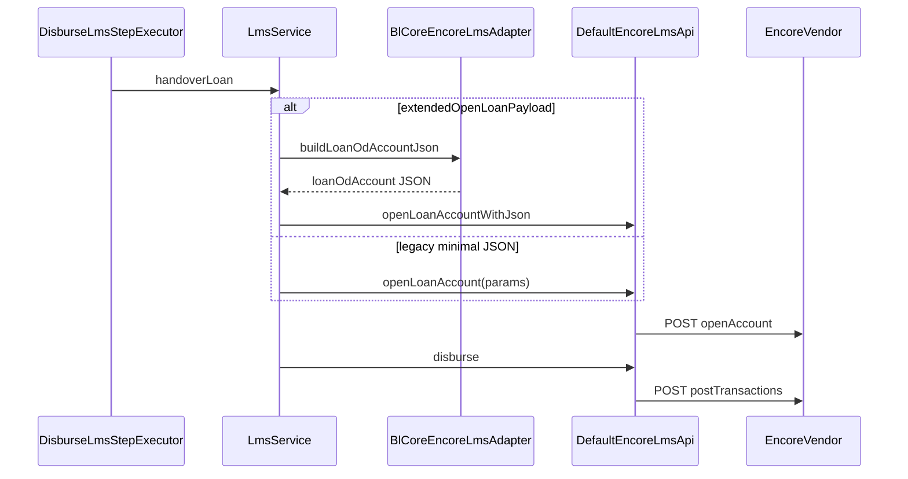

# Encore LMS: bl-core parity specification (living document)

This document satisfies the analysis deliverables for **Encore bl-core parity**: API-by-API behavior, request/response shapes, DTO mapping, persistence, workflow/KFS touchpoints, gaps, migration, and implementation order. **Canonical legacy** code: [`EncoreServiceFacadeImpl`](D:\Workspace\bl-core\code\src\main\java\com\sensei\micrograam\facade\impl\EncoreServiceFacadeImpl.java), HTTP: [`EncoreHTTPClientServiceFacadeImpl`](D:\Workspace\bl-core\code\src\main\java\com\sensei\micrograam\facade\impl\EncoreHTTPClientServiceFacadeImpl.java). **Canonical new** code: [`DefaultEncoreLmsApi`](D:\LOS\los-app\los-app\services\los-core-service\src\main\java\com\los\encore\client\api\DefaultEncoreLmsApi.java), [`LmsService`](D:\LOS\los-app\los-app\services\los-core-service\src\main\java\com\los\lms\service\LmsService.java).

Property keys (examples): [`dev-encore.properties`](D:\Workspace\bl-core\code\src\main\resources\dev-encore.properties) — mirrored under `los.lms.encore.api.*` in [`application.yml`](D:\LOS\los-app\los-app\services\los-core-service\src\main\resources\application.yml).

---

## 1. API-by-API analysis

| API property (bl-core) | HTTP | bl-core method(s) | Call sites (examples) | los-core |
|------------------------|------|---------------------|-------------------------|----------|
| `encore.api.encoreWorkingDate` | GET | `findEncoreWorkingDate` ~240 | AdminController | [`findBankWorkingDateRaw`](D:\LOS\los-app\los-app\services\los-core-service\src\main\java\com\los\encore\client\api\DefaultEncoreLmsApi.java) |
| `encore.api.createProduct` | POST body | `createProduct` ~246 | LoanProductServiceFacadeImpl | [`createProductRaw`](D:\LOS\los-app\los-app\services\los-core-service\src\main\java\com\los\encore\client\api\DefaultEncoreLmsApi.java) |
| `encore.api.createloanaccount` | POST query `transactionId`, `loanOdAccount` | `openLoanAccount` ~359 | RetailController, DsaRestController, … | [`openLoanAccount`](D:\LOS\los-app\los-app\services\los-core-service\src\main\java\com\los\encore\client\api\DefaultEncoreLmsApi.java), [`openLoanAccountWithJson`](D:\LOS\los-app\los-app\services\los-core-service\src\main\java\com\los\encore\client\api\DefaultEncoreLmsApi.java) (parity) |
| `encore.api.postTransactions` | POST query `transactions`, `commitSize=0` | `postTransactions` ~815; `disburse` ~541 | Many | Same in `DefaultEncoreLmsApi` |
| `encore.api.reversetransaction` | POST query `transactionIdJson`, `reversalUserId` | `reverse` ~147 | Reversal flows | [`reverseTransaction`](D:\LOS\los-app\los-app\services\los-core-service\src\main\java\com\los\encore\client\api\DefaultEncoreLmsApi.java) |
| `encore.api.findsummaries` | GET `accountId` JSON array, `ignoreTransactions` | `findSummaries` ~566; `findSummary` ~1092 | RetailController, repayment assemblers | [`findSummaries`](D:\LOS\los-app\los-app\services\los-core-service\src\main\java\com\los\encore\client\api\DefaultEncoreLmsApi.java), [`findSummaryFirstObject`](D:\LOS\los-app\los-app\services\los-core-service\src\main\java\com\los\encore\client\api\DefaultEncoreLmsApi.java) |
| `encore.api.findaccounts` | GET `customerId` | `findAccountsForCustomer` ~803 | Customer loan discovery | [`findLoanAccountsForCustomerRaw`](D:\LOS\los-app\los-app\services\los-core-service\src\main\java\com\los\encore\client\api\DefaultEncoreLmsApi.java) |
| `encore.api.getPrecloseAmtByValueDt` | POST query `accountId`, `valueDate` | ~1436 | Preclose / foreclosure | [`getPrecloseAmountRaw`](D:\LOS\los-app\los-app\services\los-core-service\src\main\java\com\los\encore\client\api\DefaultEncoreLmsApi.java) |
| `encore.api.findODProductInfo` | GET `productCode`, `currencyCode` | ~1456 | OD product lookup | [`findODProductInfoRaw`](D:\LOS\los-app\los-app\services\los-core-service\src\main\java\com\los\encore\client\api\DefaultEncoreLmsApi.java) |
| `encore.api.findPreOpenSummary` | POST JSON body | `findPreOpenSummary` ~1557 | BorrowerDashboardController, EmSignInfoServiceFacadeImpl | [`findPreOpenSummaryRaw`](D:\LOS\los-app\los-app\services\los-core-service\src\main\java\com\los\encore\client\api\DefaultEncoreLmsApi.java) |
| `encore.api.findLoanInfo` | GET `accountId` | `findLoanInfo` ~1637 | SanctionedInvoiceLoanServiceFacadeImpl | [`findLoanInfoRaw`](D:\LOS\los-app\los-app\services\los-core-service\src\main\java\com\los\encore\client\api\DefaultEncoreLmsApi.java) |

**Repayment path note:** bl-core [`repay`](D:\Workspace\bl-core\code\src\main\java\com\sensei\micrograam\facade\impl\EncoreServiceFacadeImpl.java) ~1036 uses **SOAP** `encoreWebService.processRepayment` for some flows; HTTP `postTransactions` is still used for disburse/reversal and LOS adapter repay. Document dual stack; LOS currently uses HTTP `postTransactions` for repay ([`DefaultEncoreLmsApi.repay`](D:\LOS\los-app\los-app\services\los-core-service\src\main\java\com\los\encore\client\api\DefaultEncoreLmsApi.java)).

---

## 2. Request structure (per API)

| API | Query parameters | Body | Serialization notes |
|-----|-------------------|------|----------------------|
| findBankWorkingDate | none | — | GET |
| createProduct | none | JSON `LoanOdProduct` serialized | bl-core `JSONSerializer` POST entity |
| openAccount | `transactionId`, `loanOdAccount` | — | `loanOdAccount` is JSON string of `LoanOdAccountWSDto` |
| postTransactions | `transactions` (JSON array of txn DTOs), `commitSize` | — | flexjson / JSONSerializer in bl-core |
| reverseTransactions | `transactionIdJson`, `reversalUserId` | — | JSON array of `"id:name"` strings |
| findSummaries / findSummary | `accountId` (JSON string of string array), `ignoreTransactions` (`"true"`/`"false"`) | — | bl-core `findSummary` uses **same URL** as findSummaries |
| findLoanOdAccounts | `customerId` | — | GET |
| findPreclosureAmountAsOfDate | `accountId`, `valueDate` | — | POST in bl-core |
| findLoanOdProduct | `productCode`, `currencyCode` | — | GET |
| findPreOpenSummary | — | JSON: `accountId`, `amountMagnitude`, `openedOnDate`, `productCode`, `tenureMagnitude`, `tenureUnit` | POST body application/json |
| findLoanInfo | `accountId` | — | GET |

los-core uses Jackson `ObjectNode` / `Map<String,String>` in [`EncoreHttpTransport`](D:\LOS\los-app\los-app\services\los-core-service\src\main\java\com\los\encore\client\http\EncoreHttpTransport.java) (query + JSON body).

---

## 3. Response structure

- **openAccount:** JSON object with `accountId` (string).
- **postTransactions:** JSONArray of posted txn summaries (legacy).
- **findSummaries:** JSONArray; each element is a large loan summary object; bl-core maps to [`EncoreFindSummariesDto`](D:\Workspace\bl-core\code\src\main\java\com\sensei\micrograam\dto\EncoreFindSummariesDto.java) in `toFindSummariesDto` (~577+), including nested **`fees`** array and **`accountStatementEntries`**.
- **findSummary:** Same endpoint as findSummaries; **first array element** is a JSONObject containing **`repaymentSchedule`** array — used by [`findRepaymentSchedules`](D:\Workspace\bl-core\code\src\main\java\com\sensei\micrograam\facade\impl\EncoreServiceFacadeImpl.java) ~1052–1086.
- **findPreOpenSummary:** Single JSONObject with `repaymentSchedule` (see `findPreOpenRepaymentSchedules` ~1588).

---

## 4. DTO mapping (bl-core ↔ los-core)

| bl-core | los-core |
|---------|----------|
| `LoanOdAccountWSDto` | JSON built in [`DefaultEncoreLmsApi`](D:\LOS\los-app\los-app\services\los-core-service\src\main\java\com\los\encore\client\api\DefaultEncoreLmsApi.java) or enriched [`BlCoreEncoreLmsAdapter`](D:\LOS\los-app\los-app\services\los-core-service\src\main\java\com\los\lms\legacy\BlCoreEncoreLmsAdapter.java) + [`LoanHandoverRequest`](D:\LOS\los-app\los-app\services\los-core-service\src\main\java\com\los\lms\dto\LoanHandoverRequest.java) |
| `LoanDto` + product | [`LoanHandoverRequest`](D:\LOS\los-app\los-app\services\los-core-service\src\main\java\com\los\lms\dto\LoanHandoverRequest.java) + [`EncoreOpenLoanParams`](D:\LOS\los-app\los-app\services\los-core-service\src\main\java\com\los\encore\client\api\EncoreOpenLoanParams.java) |
| `EncoreFindSummariesDto` | `Map<String,Object>` rows + [`EncoreSummaryNormalizer`](D:\LOS\los-app\los-app\services\los-core-service\src\main\java\com\los\lms\support\EncoreSummaryNormalizer.java) + fee columns on [`LmsAccountSummary`](D:\LOS\los-app\los-app\services\los-core-service\src\main\java\com\los\lms\entity\LmsAccountSummary.java) |
| `RepaymentScheduleDto` | [`RepaymentScheduleEntry`](D:\LOS\los-app\los-app\services\los-core-service\src\main\java\com\los\lms\dto\RepaymentScheduleEntry.java) |

---

## 5. Entity persistence mapping

| bl-core (conceptual) | los-core |
|---------------------|----------|
| Loan / account id on loan aggregate | `lms_loan_handover.encore_account_id`, `lms_account_summary.encore_account_id`, `loan_applications.lms_reference_id` (post-disburse) |
| Transaction ids | `lms_loan_handover.encore_transaction_id`, repayment callbacks |
| Customer / party id | `loan_applications.lms_encore_customer_id` (reserved, Flyway V45) |
| Summary cache | `lms_account_summary` (+ fee columns Flyway V46, statement entries JSON Flyway V47) |

---

## 6. Workflow integration points

| Step | bl-core | los-core |
|------|---------|----------|
| Disburse / LMS handover | Controllers → facade `openLoanAccount` + `disburse` | [`DisburseLmsStepExecutor`](D:\LOS\los-app\los-app\services\los-core-service\src\main\java\com\los\core\service\flow\step\DisburseLmsStepExecutor.java) → [`LmsService.handoverLoan`](D:\LOS\los-app\los-app\services\los-core-service\src\main\java\com\los\lms\service\LmsService.java) |
| Sanction + KFS | Various → Encore pre-open for schedule in some modules | [`LoanApplicationFlowService`](D:\LOS\los-app\los-app\services\los-core-service\src\main\java\com\los\core\service\loan\LoanApplicationFlowService.java) → optional [`LmsService.appendPreOpenEncoreSummaryForKfsIfEnabled`](D:\LOS\los-app\los-app\services\los-core-service\src\main\java\com\los\lms\service\LmsService.java) before [`KfsService.generateKfs`](D:\LOS\los-app\los-app\services\los-core-service\src\main\java\com\los\core\service\kfs\KfsService.java) |
| Servicing / sync | Jobs + controllers `findSummaries` | [`EncoreSummarySyncJob`](D:\LOS\los-app\los-app\services\los-core-service\src\main\java\com\los\lms\job\EncoreSummarySyncJob.java), `LmsService.getAccountSummary` |

---

## 7. Gaps (pre-implementation baseline)

- Open loan JSON missing bl-core **geo**, **party-based customerId1**, **branch from partner**, **moratorium / co-lending** (when enabled).
- Schedule: must follow bl-core **`findSummary` first object** path when `schedule-via-find-summary` is true.
- Summary: **fees** aggregation not persisted → addressed with fee columns + normalizer.
- Pre-open summary not used for KFS → optional flag + charges merge.
- Ancillary APIs: optional REST on [`LmsAdapterController`](D:\LOS\los-app\los-app\services\los-core-service\src\main\java\com\los\lms\controller\LmsAdapterController.java) — `GET /api/v1/lms/encore/loan-info/{applicationNumber}`, `GET /api/v1/lms/encore/customer-accounts/{customerId}`, `GET /api/v1/lms/encore/preclose/{applicationNumber}?valueDate=...` (raw vendor JSON strings).
- Working-date validation not enforced on LOS mutations → optional flag.

---

## 8. Required implementation changes (backlog)

1. `los.lms.encore.bl-core-parity.*` flags ([`EncoreClientProperties`](D:\LOS\los-app\los-app\services\los-core-service\src\main\java\com\los\encore\client\config\EncoreClientProperties.java)).
2. [`BlCoreEncoreLmsAdapter`](D:\LOS\los-app\los-app\services\los-core-service\src\main\java\com\los\lms\legacy\BlCoreEncoreLmsAdapter.java) + `openLoanAccountWithJson`.
3. `findSummaryFirstObject` + schedule parsing alignment.
4. Fee + statement-entry persistence (Flyway V46–V47 + normalizer + DTO).
5. Pre-open for KFS (`LmsService` + `LoanApplicationFlowService`).
6. REST wrappers for loan info / customer accounts / preclose.

---

## 9. Safe migration

- Defaults: **extended open loan = false**, **pre-open KFS = false**, **working date = false** (no behavior change).
- **schedule-via-find-summary = true** aligns with bl-core; set false if vendor JSON differs.
- Roll back via config only where possible; DB columns nullable additive.

---

## 10. Final implementation plan (PR order)

1. This spec + config keys.
2. Encore API surface + adapter + open loan JSON path (flagged).
3. Schedule + summary fees + Flyway.
4. KFS pre-open merge (flagged).
5. REST ancillary + integration tests / golden JSON tests.

---

## Sequence (disburse handover)

